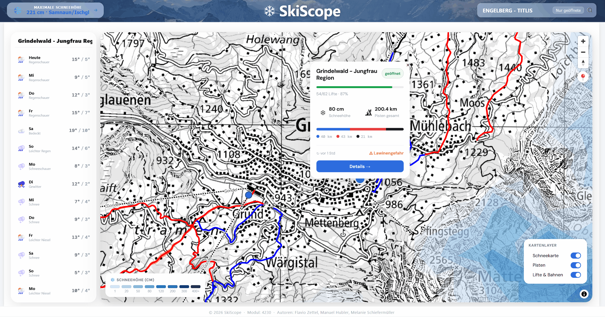

Die Wetteranzeige ist fester Bestandteil von SkiScope und wird parallel zur Karte angezeigt. Sie liefert eine 14-tägige Übersicht und auf Wunsch eine stündliche Detailansicht — beides bezieht sich auf die Wetterstation, die mit dem jeweiligen Skigebiet verbunden ist.

#### 14-Tages-Prognose in der Sidebar

Links neben der Karte zeigt die Wetter-Sidebar für die ausgewählte Wetterstation den Wetterverlauf der nächsten 14 Tage. Jeder Tag erscheint als eigene Zeile mit Wettericon, Beschreibung sowie Minimal- und Maximaltemperatur. Icon und Beschreibung werden aus dem WMO-Code abgeleitet, der von Open-Meteo geliefert wird.

Beim Start der Anwendung wird zunächst das Wetter für eine Standardstation geladen. Wählt der Nutzer ein Skigebiet aus, aktualisiert sich die Sidebar automatisch mit den Wetterdaten dieses Gebiets.

#### Stündliche Detailansicht eines Tages

Fährt die Maus über einen Tag in der Sidebar, wird die Zeile aufgeklappt und ein Button für die Detailansicht eingeblendet. Diese Detailansicht ist bewusst nur für die ersten **sieben Tage** verfügbar, da Open-Meteo für längerfristige Prognosen keine ausreichend zuverlässigen Stundenwerte mehr liefert. Diese Einschränkung wird so direkt im Interface kommuniziert, statt mit einer Fehlermeldung nach dem Klick.

In der Detailansicht werden die stündlichen Wetterdaten als Diagramm dargestellt — Temperatur, Niederschlag und Sonnenscheindauer im zeitlichen Verlauf. Ergänzt wird das Diagramm um Tagesstatistiken: minimale und maximale Temperatur, gefühlte Temperatur, Regen- und Schneesumme, maximale Windgeschwindigkeit und Böen, Bewölkung sowie Sonnenscheindauer.

#### Datenquelle und Caching

Die Wetterdaten stammen von **Open-Meteo** und werden vom SkiScope-Backend zwischengespeichert. Zwischen aufeinanderfolgenden Anfragen vergehen nie mehr Open-Meteo-Calls als nötig: Pro Skigebiet wird die Prognose nur dann neu geholt, wenn der DB-Cache älter als drei Stunden ist. Details dazu auf der [Server-Seite]({{ '/architektur_gdi.html#server' | relative_url }}).

