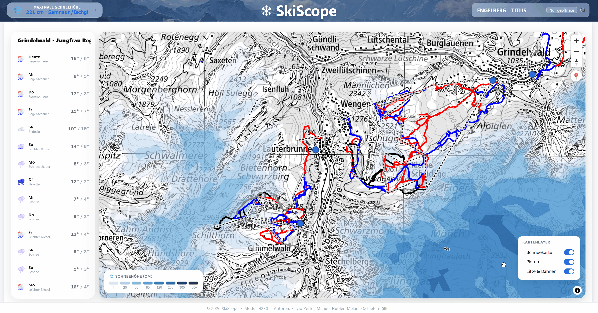

### Layersteuerung

Die Karte von SkiScope bündelt mehrere thematische Layer: die schweizweite **Schneehöhenkarte** sowie die **Pisten** und **Lifte** der einzelnen Skigebiete. Damit die Karte auf jeder Zoomstufe lesbar bleibt, kombiniert SkiScope eine automatische Layer-Steuerung mit einer manuellen Bedienleiste.

#### Automatische Sichtbarkeit nach Zoomstufe

Beim Hineinzoomen ändert sich die Layer-Sichtbarkeit automatisch. Bei kleinem Massstab steht die schweizweite Schneehöhenkarte im Vordergrund — sie zeigt auf einen Blick, wo aktuell überhaupt Schnee liegt. Erst beim Hineinzoomen in einzelne Skigebiete (ab Zoomstufe 13) erscheinen zusätzlich Pisten und Lifte. Dadurch bleibt die Karte auf jeder Ebene aufgeräumt, ohne dass der Nutzer Layer manuell aktivieren muss.

#### Manuelle Layer-Bedienleiste

Unten rechts auf der Karte befindet sich die Bedienleiste „Kartenlayer". Mit einem Klick lassen sich die Layer **Schneehöhe**, **Pisten** und **Lifte & Bahnen** unabhängig vom Zoom an- oder ausschalten. Eine manuelle Auswahl überschreibt die automatische Zoom-Logik, sodass der Nutzer jederzeit die Kontrolle über die Darstellung behält.

#### Legende

Direkt darüber zeigt die Legende die Farbskala der Schneehöhenkarte in Zentimetern. Die Farben stammen aus der vom SLF gelieferten GeoJSON-Definition und bleiben dadurch konsistent mit deren offizieller Darstellung.

#### Datenfluss

Sämtliche Kartenlayer werden vom **GeoServer** als Mapbox Vector Tiles (MVT) ausgeliefert und direkt vom Client gerendert. Die Tiles werden vom Browser gecacht, sodass wiederholte Karteninteraktionen ohne erneute Serveranfragen auskommen. Hintergrundkarte sind die **Swisstopo Vector Tiles**.

