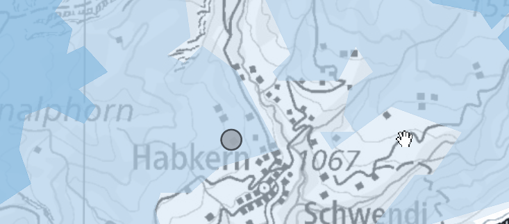

Der Client ist die Weboberfläche von SkiScope und vereint Karte, Suche, Detailansichten und Wetterprognose in einer einzigen interaktiven Anwendung. Technisch basiert er auf einer **React-/Vite-Anwendung**, die alle Karteninhalte über **MapLibre GL JS** rendert.

---

### Verwendete Technologien

- **React** – Komponentenbasierte Benutzeroberfläche.
- **Vite** – Build-Tool und Entwicklungsserver mit schnellem Hot-Reload.
- **MapLibre GL JS** – WebGL-basiertes Rendering der Karte und der GeoServer-Vector-Tiles.
- **react-map-gl** – React-Wrapper, der MapLibre deklarativ in den Komponentenbaum einbettet.
- **Recharts** – Darstellung der stündlichen Wetterdaten als Diagramm.

Eine vollständige Auflistung aller eingesetzten Bibliotheken findet sich auf der Seite [Libraries and Technologies]({{ '/architektur_gdi.html#libraries_and_technologies' | relative_url }}).

#### Warum MapLibre und nicht OpenLayers?

Die Wahl fiel auf MapLibre GL JS, da GeoServer die SkiScope-Layer als Mapbox Vector Tiles (MVT) ausliefert. Durch das native WebGL-Rendering bleibt die Darstellung auch bei grossen Datenmengen performant. OpenLayers hätte für die vektorbasierte, hochinteraktive Anwendung keinen Vorteil gebracht. Zudem integriert sich MapLibre über react-map-gl gut in den React-Aufbau.
MapLibre unterstützt jedoch ausschliesslich Web Mercator (EPSG:3857). Da alle verwendeten Datenquellen bereits in WGS 84 vorlagen, war keine Reprojektion nötig. Eine sichtbare Einschränkung zeigt sich jedoch bei der Swisstopo-Basiskarte, da deren Vector Tiles in LV95 publiziert werden, erscheinen die Koordinatenlinien in MapLibre leicht schräg.

---

### Gestalterische Grundprinzipien

Die Oberfläche folgt einigen wenigen Leitideen, die sich durch alle Komponenten ziehen.

**Karte als Hauptbühne.** Die MapLibre-Karte nimmt den zentralen Platz ein. Sidebars, Popups und Detailansichten ordnen sich ihr unter und verdecken sie nur dort, wo es für den jeweiligen Schritt nötig ist. Das räumliche Bild bleibt damit immer der Anker.

**Progressive Disclosure.** Informationen werden nicht alle gleichzeitig gezeigt, sondern in Stufen. Beim Hover über ein Skigebiet erscheint ein minimaler Tooltip mit dem Namen. Ein Klick öffnet ein Popup mit den wichtigsten Kennzahlen. Erst der Knopf „Details →" führt in die Vollansicht. So entscheidet der Nutzer selbst, wie tief er einsteigt.

**Zoom als Filter.** Welche Layer sichtbar sind, hängt vom Massstab ab. Bei kleinem Massstab wird die schweizweite Schneekarte gezeigt, beim Hineinzoomen erscheinen zusätzlich Pisten und Lifte. Dadurch bleibt die Karte auf jeder Zoomstufe lesbar, ohne dass der Nutzer Layer manuell aktivieren muss.

**Farbcodierung als visuelle Sprache.** Wiederkehrende Sachverhalte werden konsistent eingefärbt: blaue Skigebietspunkte signalisieren geöffnete Gebiete, graue geschlossene. Pisten werden in den international etablierten Schwierigkeitsfarben (blau, rot, schwarz) dargestellt. Liftstatus wird über farbige Badges und Fortschrittsbalken sofort erfassbar gemacht.

---

### User Guiding

Aus diesen Prinzipien ergeben sich konkrete Interaktionsmuster.

**Suche.** Das Suchfeld im Header reagiert auf Tastendrücke, fragt aber nicht bei jedem einzelnen Zeichen neu — ein kurzer Timer („Debounce") fasst Eingaben zusammen. Sowohl der Suchbegriff als auch die geladenen Skigebietsnamen werden in Kleinbuchstaben verglichen, sodass Gross-/Kleinschreibung keine Rolle spielt. Maximal sechs Treffer werden angezeigt, damit das Dropdown übersichtlich bleibt. Ein optionaler Filter „Nur geöffnete" schränkt die Resultate auf Skigebiete mit mindestens einem offenen Lift ein. Ein Klick auf einen Treffer löst eine GeoServer-Anfrage nach den Koordinaten aus und zoomt die Karte automatisch auf das gewählte Gebiet.

**Hover-Feedback.** Sobald die Maus über ein Skigebiet fährt, wird der Punkt hervorgehoben und ein Mini-Tooltip mit dem Namen eingeblendet. Der Nutzer weiss damit vor dem Klick, was ihn erwartet — ein bewusst minimaler Zwischenschritt.

**Skigebiet-Popup.** Beim Klick erscheint ein kompaktes Popup direkt am Marker. Es zeigt Schneehöhe, Pistenkilometer und den Liftstatus inkl. Status-Badge und Fortschrittsbalken sowie die Verteilung der Pisten nach Schwierigkeit als farbigen Balken. Das Popup ist die Brücke zwischen schneller Übersicht auf der Karte und der vollen Detailansicht.

**Detailansicht.** Wer mehr wissen will, öffnet die zweispaltige Detailansicht: links eine Info-Card mit allen Kennzahlen (Pisten, Lifte, Schneehöhen, Langlauf, Schlitteln, Winterwandern, Kontaktdaten), rechts eine fokussierte Karte, die per `bbox` automatisch auf das Skigebiet zoomt und die relevanten Layer (Schnee, Pisten, Lifte) bereits aktiviert hat. So kann das Gebiet auch räumlich genauer betrachtet werden, ohne den Kontext der Hauptkarte zu verlieren.

**Wetter-Sidebar.** Links neben der Karte zeigt die Sidebar die 14-Tages-Prognose der ausgewählten Wetterstation. Beim Hover über eine Tagesreihe erscheint ein Button für die Detailansicht — allerdings nur für die ersten sieben Tage, da Open-Meteo darüber hinaus keine Stundendaten mehr liefert. Diese Einschränkung wird so visuell vom Interface kommuniziert, statt durch eine Fehlermeldung nach dem Klick.

---

### States und Fehlerbehandlung

Da Daten aus mehreren externen Quellen kommen, wird jeder Ladezustand explizit dargestellt.

**Loading.** Solange eine Backend-Antwort aussteht, zeigt das betreffende Element einen Spinner. Die Karte bleibt dabei bedienbar.

**Fehlende Werte.** Fehlen einzelne Werte — etwa weil ein Gebiet keine Langlaufloipen hat. Hier werden die entsprechenden Abschnitte einfach ausgeblendet.

Ein Sonderfall ist die Wetter-Sidebar: Da Open-Meteo nur für die ersten sieben Tage Stundendaten liefert, wird der Detail-Button für spätere Tage gar nicht erst angezeigt.

---

### Zusammenspiel mit dem Server

Der Client nutzt zwei unterschiedliche Wege auf den Server (ausführlich beschrieben auf der [Server-Seite]({{ '/architektur_gdi.html#server' | relative_url }})):

- **Karten-Layer** (Schneehöhen, Pisten, Lifte, Skigebietspunkte) werden direkt vom **GeoServer** als Vector Tiles bezogen. Die Tile-URLs werden über die Hilfsfunktion `geoserverTileUrl()` aus `mapConfig.js` aufgebaut.
- **Strukturierte Sachdaten** (Skigebiet-Liste, Detaildaten, Wetterprognose) gehen über die **FastAPI**.

Die Zuordnung zwischen UI-Aktion und Endpunkt:

| UI-Aktion                                                    | Endpunkt                                   |
| ------------------------------------------------------------ | ------------------------------------------ |
| Initiales Laden der Skigebiete (für Suche und Marker-Status) | `GET /skigebiete`                          |
| Klick auf einen Skigebiets-Marker (Popup-Inhalt)             | `GET /skigebiet?station_id=`               |
| Öffnen der Detailansicht                                     | `GET /skigebiet/detail?station_id=`        |
| 14-Tages-Prognose in der Wetter-Sidebar                      | `GET /skigebiet/wetterprognose?type=woche` |
| Stündliche Detailansicht eines Wettertages                   | `GET /skigebiet/wetterprognose?type=tag`   |

---

### Projektstruktur

Der Client liegt im Verzeichnis `client/` und ist klassisch nach React-/Vite-Konventionen aufgebaut:

    client/
    ├── public/
    ├── src/
    │   ├── config.js, mapConfig.js   # zentrale Konfiguration & Helper
    │   ├── *.jsx                     # React-Komponenten
    │   └── *.css                     # zugehörige Stylesheets
    ├── index.html
    ├── package.json
    └── vite.config.js

Die zentrale Konfiguration ist in `config.js` und `mapConfig.js` gebündelt — dort liegen API- und GeoServer-URLs, Kartenstile, Wetterdefinitionen, Kartenbegrenzungen sowie Legenden für die Schneehöhen-Visualisierung. Die Trennung von Logik (`.jsx`) und Gestaltung (`.css`) hält die Komponenten übersichtlich und vereinfacht spätere Anpassungen am Erscheinungsbild, ohne die React-Logik anfassen zu müssen.
