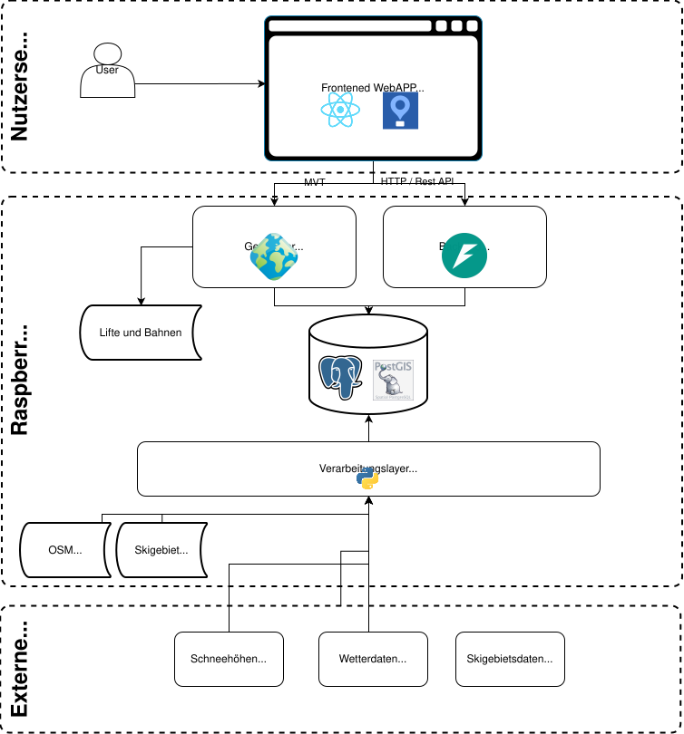

Der Server bündelt sämtliche Datenflüsse zwischen externen Datenquellen, der eigenen Datenhaltung und dem Client. Die gesamte Server-Infrastruktur läuft auf einem **Raspberry Pi** und besteht aus drei Komponenten: einem **GeoServer** für die Bereitstellung OGC-Konformer Kartenelemente, einer **PostgreSQL-/PostGIS-Datenbank** für die Daten- und Cache-Haltung sowie einer **FastAPI-Anwendung** als REST-Schnittstelle.

---

### Architekturüberblick



Das Zusammenspiel der Komponenten lässt sich in drei Ebenen einteilen:

1. **Client-Ebene** – die React-/MapLibre-Anwendung im Browser des Nutzers.
2. **Server-Ebene** – GeoServer, FastAPI und PostgreSQL/PostGIS auf dem Raspberry Pi.
3. **Externe Datenquellen** – Open-Meteo (Wetter), SLF (Schneehöhen), STNet (Betriebsstatus) sowie Overpass/OpenStreetMap (initialer Geometrie-Import).

Der Client kommuniziert ausschliesslich mit dem Raspberry Pi. Die externen APIs werden niemals direkt aus dem Browser angesprochen, sondern stets über die FastAPI als zwischengeschaltete Vermittlungsschicht.

---

### Verwendete Technologien

Auf dem Server kommen folgende Technologien zum Einsatz:

- **FastAPI** (0.121.3) als REST-Framework (Python), inkl. `BackgroundTasks` für asynchrone DB-Schreibvorgänge.
- **psycopg2** (2.9.10) als PostgreSQL-Treiber.
- **openmeteo-requests** (1.7.5) in Kombination mit **requests-cache** und **retry-requests** (2.0.0) für robuste, gecachte Open-Meteo-Anfragen.
- **PostgreSQL** (17.9) **mit PostGIS** (3.5) als zentrale Datenhaltung, sowohl für Sachdaten als auch für Geometrien (Pisten, Lifte, Skigebiete, Schneehöhen-Polygone).
- **GeoServer** (2.28.3), der die Geometrien direkt aus PostGIS als **Mapbox Vector Tiles (MVT)** ausliefert.

Eine vollständige Auflistung aller eingesetzten Bibliotheken findet sich auf der Seite [Libraries and Technologies]({{ '/architektur_gdi.html#libraries_and_technologies' | relative_url }}).

---

### Zusammenspiel von Frontend, GeoServer und Backend

Die Kartenlayer werden im Frontend über `react-map-gl` eingebunden.

Die Kommunikation zwischen Frontend und Server ist folgendermassen aufgeteilt:

- **GeoServer** liefert performante Mapbox Vector Tiles (MVT) für alle geometrischen Daten wie Schneehöhen, Pisten, Lifte und Skigebiete.
- **FastAPI** liefert strukturierte JSON-Daten für Detailansichten, Wetterdaten oder Statusinformationen.

Für den Schneehöhen-Layer wird zusätzlich ein `viewparams`-Parameter verwendet, um die Daten serverseitig nach Datum zu filtern:

```js
geoserverTileUrl("schneehoehen_datum", `&viewparams=datum:${safeDatum}`);
```

Die eingebundenen Layer sind:

| Layer       | Geometrietyp    | Datenquelle |
| ----------- | --------------- | ----------- |
| Schneehöhen | Polygon         | PostGIS     |
| Pisten      | Polygon / Linie | PostGIS     |
| Lifte       | Polygon / Linie | GeoPackage  |
| Skigebiete  | Punkt           | PostGIS     |

Das Styling erfolgt vollständig clientseitig in MapLibre. Dadurch können Farben, Transparenzen, Filter und Hover-Effekte dynamisch angepasst werden.

- Pisten werden anhand ihres Schwierigkeitsgrades eingefärbt.
- Schneehöhen verwenden eine abgestufte Blau-Skala.
- Liftanlagen werden als schwarze Linien mit Beschriftung dargestellt.
- Skigebiete wechseln ihren Status dynamisch zwischen geöffnet und geschlossen.

Zusätzlich wird die Sichtbarkeit einzelner Layer automatisch an den Zoomlevel angepasst: Bei kleinen Zoomstufen bleibt die Schneekarte sichtbar, während ab höheren Zoomstufen detaillierte Pisten- und Liftlayer eingeblendet werden. Dieses Verhalten kann über das Layer-Panel manuell überschrieben werden.

---

### Caching-Strategien

Da SkiScope auf einem Raspberry Pi läuft und die externen APIs (insbesondere Open-Meteo) mit Rate-Limits arbeiten, ist das Caching ein zentraler Bestandteil der Server-Architektur. Es kommen mehrere Cache-Schichten parallel zum Einsatz.

#### Wetter-Cache in PostgreSQL

Wetterdaten werden in zwei Tabellen vorgehalten: `wetter_skigebiet_d` für tägliche Zusammenfassungen (14-Tages-Prognose) und `wetter_skigebiet_h` für stündliche Detaildaten. Beide Tabellen halten je Skigebiet die zuletzt empfangenen Open-Meteo-Werte vor.

Bei jeder Anfrage an `/skigebiet/wetterprognose` prüft der Server zuerst, ob in der DB bereits ein Eintrag existiert und ob dieser jünger als drei Stunden ist. Ist beides der Fall, wird direkt aus der DB geantwortet. Andernfalls wird Open-Meteo angefragt, die Antwort sofort an den Client zurückgegeben und parallel über `BackgroundTasks` per `UPSERT` in die DB geschrieben. Dadurch wartet der Nutzer nie auf den DB-Schreibvorgang.

#### Schneehöhen-Cache in PostgreSQL

Die SLF-Schneehöhen werden in der Tabelle `schneehoehen` als PostGIS-Polygone gespeichert. Beim Aufruf von `/schnee` prüft der Server für jeden der letzten sieben Tage einzeln, ob bereits Daten vorliegen. Nur fehlende Tage werden vom SLF nachgeladen. Dadurch entstehen pro Tag maximal sieben externe Calls — und das auch nur, wenn der Endpunkt zum ersten Mal nach längerer Pause aufgerufen wird.

#### Browser- und GeoServer-Tile-Cache

Vector Tiles werden vom Browser anhand der HTTP-Cache-Header zwischengespeichert. Solange sich die Geometrien nicht ändern, müssen wiederholt aufgerufene Kartenausschnitte nicht erneut vom GeoServer gerendert werden.

---

### Maximale API-Last

Aus den oben beschriebenen Caching-Strategien ergibt sich eine berechenbare obere Schranke für die Anzahl externer API-Anfragen pro Tag. Grundlage der folgenden Rechnung ist der aktuelle Datenbestand von **211 Skigebieten** sowie die Cache-Frische von **3 Stunden**, was **8 Refresh-Fenster pro Tag** ergibt.

#### Open-Meteo – Wochenprognose

Pro Skigebiet wird die Wochenprognose im Worst Case einmal pro 3-Stunden-Fenster neu geladen:

```
211 Skigebiete × 8 Fenster/Tag = 1 688 API-Calls/Tag
```

#### Open-Meteo – Stundenprognose

Die Stundenprognose wird je angefordertem Tag separat zwischengespeichert. Pro Refresh werden **zwei** Open-Meteo-Modelle abgefragt (MeteoSwiss ICON Seamless für hohe Genauigkeit, ECMWF IFS als Fallback für den verlängerten Zeitraum). Bei einem Vorhersagehorizont von 14 Tagen ergibt das im theoretischen Maximum:

```
211 Skigebiete × 7 Tage × 8 Aktualisierungen/Tag = 11 816 API-Calls/Tag
```

Der Openmeteo Plan "free" erlaubt maximal 10 000 Anfragen pro Tag. Dies würde mit der Worst-Case Berechnung knapp überschritten. Für eine realistische Nutzung im Testbetrieb reicht das aber aus.

#### SLF Schneehöhen

```
maximal 7 API-Calls/Tag
```

Da pro Tag nur ein einziger Datensatz benötigt wird und bestehende Daten nie nachgeladen werden, sind sieben Calls bereits der absolute Maximalwert (einmaliger Aufholimport nach längerem Stillstand).

---

### Endpunkte im Überblick

| Endpunkt                                   | Zweck                                            | Cache-Verhalten                         |
| ------------------------------------------ | ------------------------------------------------ | --------------------------------------- |
| `GET /skigebiete`                          | Liste aller Skigebiete (Name + Status der Lifte) | Direkt aus DB, kein Cache nötig         |
| `GET /skigebiete/top-schnee`               | Skigebiet mit der höchsten Pisten-Schneehöhe     | Direkt aus DB                           |
| `GET /skigebiet?station_id=`               | Kennzahlen eines einzelnen Skigebiets            | Direkt aus DB                           |
| `GET /skigebiet/detail?station_id=`        | Vollständige Detaildaten inkl. Bounding-Box      | Direkt aus DB (BBox via `ST_Extent`)    |
| `GET /skigebiet/wetterprognose?type=woche` | 14-Tages-Prognose                                | DB-Cache (3 h) → Open-Meteo             |
| `GET /skigebiet/wetterprognose?type=tag`   | Stündliche Prognose eines Tages                  | DB-Cache (3 h) → Open-Meteo (2 Modelle) |
| `GET /schnee`                              | Triggert den SLF-Import der letzten 7 Tage       | Inkrementell, nur fehlende Tage         |

---

### Datenbank

Die PostgreSQL-/PostGIS-Datenbank trennt vier Datenkategorien sauber voneinander:

- **Stammdaten der Skigebiete** in `skigebiete` (Adresse, Telefon, Öffnungszeiten, URL).
- **Aggregierte Kennzahlen** in der View `skigebiete_kennzahlen` (Anzahl offener Pisten/Lifte, Pistenkilometer, Schneehöhen).
- **Geometrien** in `skigebiet_geom`, `pisten_geom_multipolygon`, `pisten_geom_multiline`, `langlauf` und `schlittelwege`.
- **Caches** für Wetter (`wetter_skigebiet_d`, `wetter_skigebiet_h`) und Schneehöhen (`schneehoehen`).

Die View `skigebiete_kennzahlen` aggregiert verschiedene Quelltabellen zu einem flachen Datensatz pro Skigebiet, was die FastAPI-Endpunkte deutlich vereinfacht. Die BBox-Berechnung im Endpunkt `/skigebiet/detail` greift via `ST_Extent` über alle Geometrie-Tabellen eines Skigebiets und liefert eine MapLibre-kompatible Bounding-Box `[minLng, minLat, maxLng, maxLat]`, die der Client direkt für `fitBounds` weiterverwenden kann.
