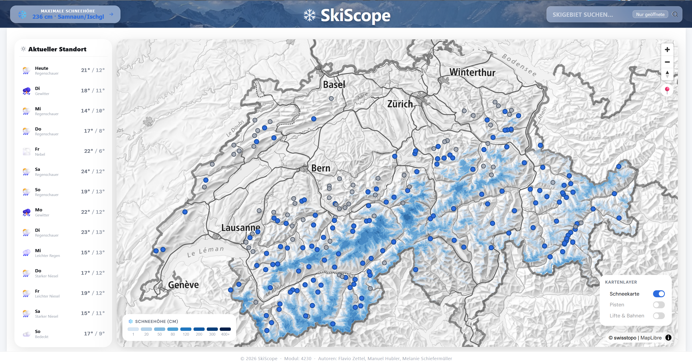

# Dein Weg zum perfekten Ski-Erlebnis

Skiscope ist eine Webanwendung mit dem Ziel die Planung Deiner Skitage zu erleichern. Mit aktuellen Informationen zu geöffneten Skigebieten, Pisten und Schneeverhältnissen bietet es eine hervorragende Übersicht über das Wintersportangebot der Schweiz. Egal ob Du auf der suche nach einem neuen Lieblingsskigebiet bist, oder nur wissen willst, ob auf der Thalabfahrt Schnee liegt. Alle nötigen Informationen findest du auf Skiscope.

Finde auf der [Feature Seite](features.html) heraus, was SkiScope alles kann!

<figure class="image-container">
  

  <figcaption>
    Abbildung 1: Übersicht der Webanwendung SkiScope mit Darstellung der Schweizer Skigebiete, Wetterinformationen und Layersteuerung.
  </figcaption>
</figure>

Das folgende Video demonstriert den Aufbau der Webseite sowie die verschiedenen Interaktionsmöglichkeiten. Es vermittelt einen direkten Eindruck von den verfügbaren Features und dem Benutzererlebnis der Anwendung.

<video autoplay muted loop playsinline class="gifs">
  <source src="assets/gifs/Nutzerfuehrung_.mp4" type="video/mp4">
</video>

#### Quellen

GitHub Repository: https://github.com/Flaviozettel/SkiScope
